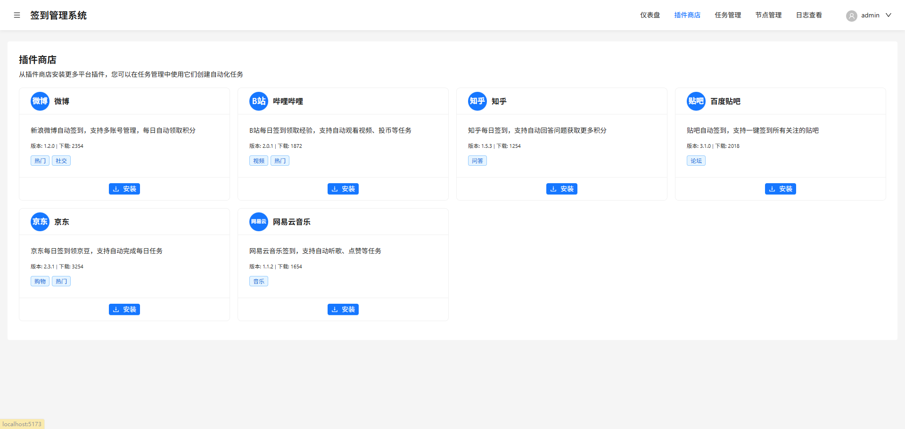

# 签到管理系统

一个基于React 19和Ant Design 5构建的现代化签到管理系统，使用Vite作为构建工具。

## 写在前面
目前还没有完成，只是把页面实现了，agent写完了，这个页面的服务端还在写。

## 目前的想法
### 架构图


### 任务下发时序图


## 项目概述

突发奇想打算做一个插件化的自动签到系统，由开发者维护插件商店，其他人可自行上传写好的签到插件，又多个node节点去执行签到任务（需自行部署node节点），这样不同签到任务可以用不同地区的服务器来签到。

## 主要功能

### 仪表盘


### 插件商店


### 任务管理


### 节点管理


### 日志查看


## 技术栈

- **前端框架**：React 19.1.0
- **UI组件库**：Ant Design 5.26.5
- **路由管理**：React Router 7.6.3
- **构建工具**：Vite 7.0.4
- **CSS规范化**：normalize.css 8.0.1
- **图标库**：@ant-design/icons 6.0.0
- **日期处理**：dayjs 1.11.11

## 开始使用

### 环境要求

- Node.js（最新LTS版本）
- npm（包管理器）

### 安装依赖

```bash
npm install
```

### 启动开发服务器

```bash
npm run dev
```

### 构建生产版本

```bash
npm run build
```

### 代码质量检查

```bash
npm run lint
```

### 预览生产构建

```bash
npm run preview
```

## 项目结构

```
├── public/            # 静态资源
├── src/               # 源代码
│   ├── components/    # 通用组件
│   ├── views/         # 页面视图
│   │   ├── Home/      # 仪表盘
│   │   ├── AppStore/  # 插件商店
│   │   ├── Tasks/     # 任务管理
│   │   ├── Nodes/     # 节点管理
│   │   ├── Logs/      # 日志查看
│   │   ├── Settings/  # 系统设置
│   │   ├── Login/     # 登录页面
│   │   └── About/     # 关于页面
│   ├── main.jsx       # 应用入口
│   └── index.css      # 全局样式
├── index.html         # HTML模板
├── vite.config.js     # Vite配置
└── package.json       # 项目配置
```
